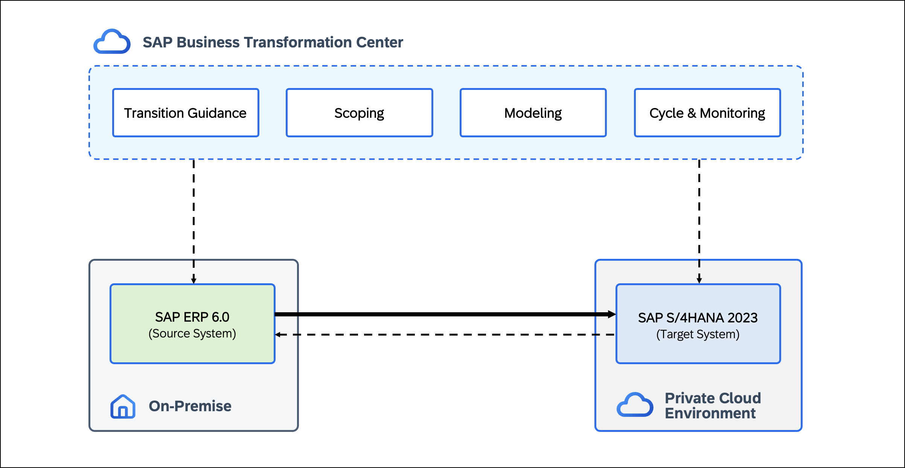

# DT264 - How to start transitioning to SAP Cloud ERP Private (ASUG)

## Overview

This hands-on session shows how to transition from <b>SAP ERP 6.0</b> to <b>SAP Cloud ERP Private</b> using <b>SAP Business Transformation Center</b> (BTC). It provides a practical introduction to the tools and concepts that support a data-driven transformation journey.

During the session, you will evaluate transition options using the <b>Find Transformation Approach</b> app and initialize your first transformation project. These steps form the foundation for executing a <b>Selective Data Transition</b> in later exercises, enabling a <b>smooth</b> and <b>data-driven</b> move to <b>SAP Cloud ERP Private</b>.

  

## Requirements
To complete the exercises in this hands-on session, you need **SAP GUI** and a **web browser** (preferably **Google Chrome**).  

## Exercises

Building on the concepts introduced above, the following exercises take you through <b>each phase</b> of a <b>data-driven transition</b> using <b>SAP Business Transformation Center</b> — from <b>transformation guidance</b> and <b>scoping</b> to <b>modeling</b> and <b>executing</b>.

Step by step, you will analyze your <b>system data</b>, define your <b>transformation approach</b>, and <b>execute the transition</b> to <b>SAP Cloud ERP Private</b> in a lean and controlled way.

Below you find an overview of all exercises included in this hands-on session:

- [Scenario Overview](exercises/ex0/)
- [Exercise 1 - Build the Foundation: Upload UDP & MRC File](exercises/ex1/)
- [Exercise 2 - Analyze Transition Options: Find Transition Approach](exercises/ex2/)
- [Exercise 3 - Initialize Project: Create Digital Blueprint](exercises/ex3/)
- [Exercise 4 - Scope the Blueprint: Select & Reduce Data](exercises/ex4/)
- [Exercise 5 - Build the Model: Create Transformation Model & Version](exercises/ex5/)
- [Exercise 6 - Initialize Cycle: Create Cycle & Run Prevalidation](exercises/ex6/)
- [Exercise 7 - Execute Blueprint: Review Reference Cycle](exercises/ex7/)

 

## Contributing
Please read the [CONTRIBUTING.md](./CONTRIBUTING.md) to understand the contribution guidelines.  

## Code of Conduct
Please read the [SAP Open Source Code of Conduct](https://github.com/SAP-samples/.github/blob/main/CODE_OF_CONDUCT.md).  

## How to obtain support

Support for the content in this repository is available during the actual time of the online session for which this content has been designed. Otherwise, you may request support via the [Issues](../../issues) tab.  

## License
Copyright (c) 2025 SAP SE or an SAP affiliate company. All rights reserved. This project is licensed under the Apache Software License, version 2.0 except as noted otherwise in the [LICENSE](LICENSES/Apache-2.0.txt) file.
